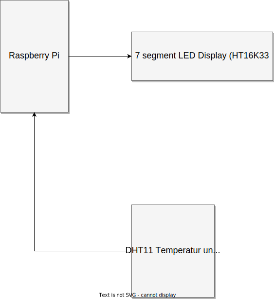
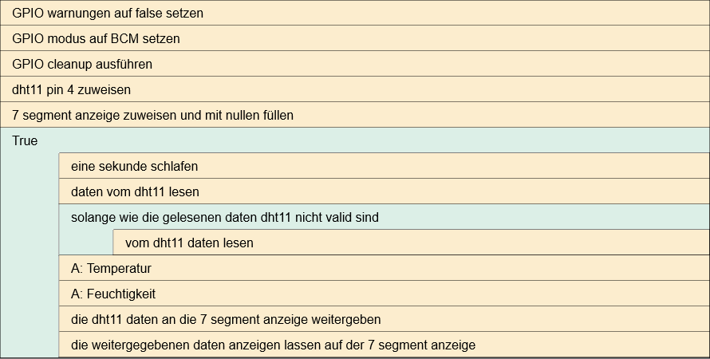

# Greenhouse

## Pi login
```sh
ssh pi@ITJoy-Pi02
pw: adminadmin
```

- Dokumentation
    - [LF7_Gewächshaussteuerung_Projektaufgabenstellung.pdf](./Doc/LF7_Gewächshaussteuerung_Projektaufgabenstellung.pdf)
    - [RB-JoyPi-Manual-2022-04-08.pdf](./Doc/RB-JoyPi-Manual-2022-04-08.pdf)
    - link zur vollen [Doku](link)

- Simulator
    - https://wokwi.com/projects/new/micropython-pi-pico

## Blockschaltplan


## Strucktogramm


## Script Ausführen

```sh
python3 ./main.py
```
oder
```sh
chmod +x ./main.py # muss nur einmalig gemacht werden
./main.py
```
