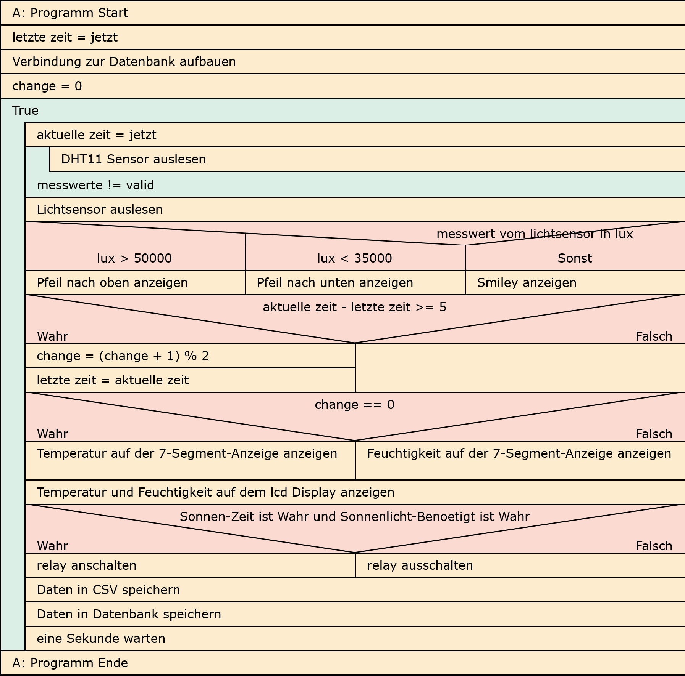

# Greenhouse

## Pi login
```sh
ssh pi@ITJoy-Pi02
pw: adminadmin
```

- Dokumentation
    - [LF7_Gewächshaussteuerung_Projektaufgabenstellung.pdf](./Doc/LF7_Gewächshaussteuerung_Projektaufgabenstellung.pdf)
    - [RB-JoyPi-Manual-2022-04-08.pdf](./Doc/RB-JoyPi-Manual-2022-04-08.pdf)
    - link zur vollen [Doku](link)

- Simulator
    - https://wokwi.com/projects/new/micropython-pi-pico

## Blockschaltplan


## Strucktogramm


## Script Ausführen

### 1. Die zip Datei auf den Raspberrypi bekommen

Hierzu gibt es zwei Möglichkeiten

in beiden fällen, Wenn sie nach einem Passwort gefragt werden geben sie `adminadmin` ein

Erste möglichkeit: Datei vom Windows peer scp/ssh rüber auf den Raspberrypi senden

```sh
scp ./myFolder.zip pi@ITJoy-Pi02:~/
```

Zweite möglichkeit: SSH Verbindung zum Raspberrypi aufbauen und die .zip Datei dort herunterladen

```sh
ssh pi@ITJoy-Pi02
```

Und die Datei herunterladen
```sh
cd ~
wget https://github.com/Katze719/Greenhouse/archive/refs/heads/main.zip
```

### 2. Zip Datei entpacken (kann übersprungen werden wenn der gesendete ordner peer ssh schon entpackt worden ist)

unzip installieren wenn es noch nicht vorhanden ist
```sh
sudo apt-get install unzip
```

entpacken
```sh
unzip myFolder.zip
```

### 3. Script ausführen

```sh
cd ./Greenhouse-main
```

```sh
python3 ./main.py
```
oder
```sh
chmod +x ./main.py # muss nur einmalig gemacht werden
./main.py
```
